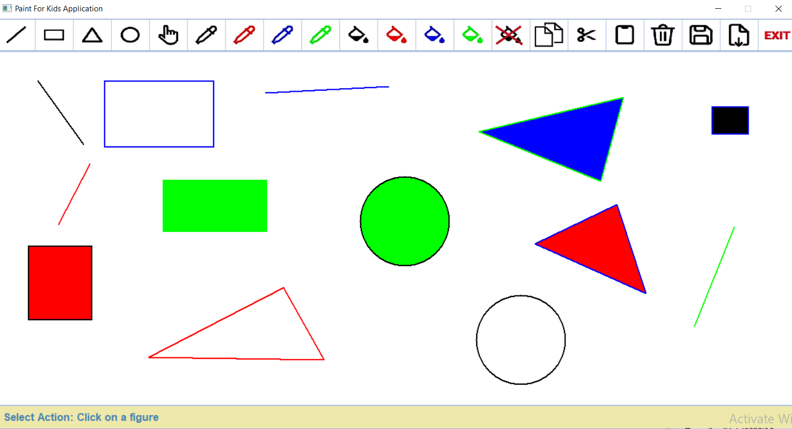
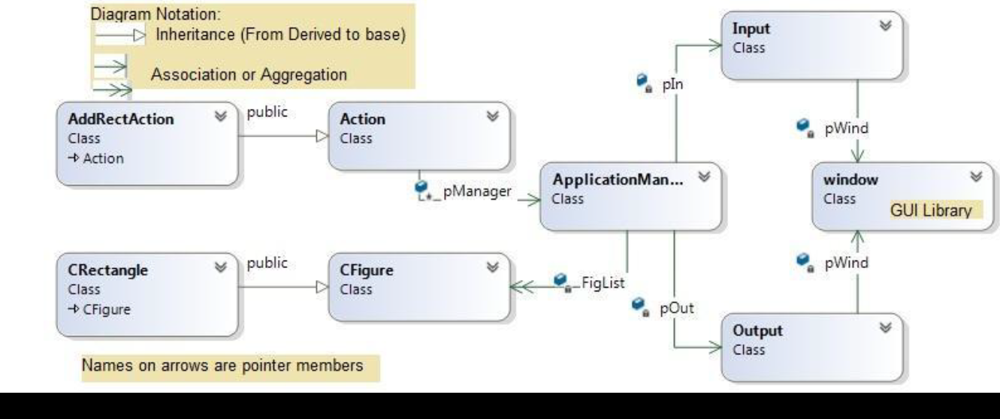

# OOP C++ Project - Paint For Kids Application
The application supports drawing different figures as well as changing their drawing and filling colors. It also supports copying, cutting, pasting and deleteing figures. In addition, graphs can be saved to and loaded from text files.  

## Application GUI

#### The GUI is divided into 3 sections:  
**Toolbar:** Contains all icons that represent all actions that can be made by a user.   
**Drawing area:** White space where a user can draw different figures.   
**Statusbar:** Displays messages to the user.   

## Supported Actions
#### Each action has its corresponding icon in the toolbar.  
##### *Note: You should click at the icon corresponding to each action before making it.     
**Draw Line:** By clicking at the two points of a line.  
**Draw Rectangle:** By clicking at the two corners of a rectangle.  
**Draw Triangle:** By clicking at the three corners of a triangle.  
**Draw Circle:** By clicking at the center of a circle.  
**Select a figure:** By clicking at a figure in the drawing area.  
**Change drawing color:** If a figure is selected, its frame color will be changed. If not, the drawing color for the upcoming figures will be changed.  
**Change filling color:** If a figure is selected, its filling color will be changed. If not, the filling color for the upcoming figures will be changed.    
**Copy figure:** First select a figure then copy it.  
**Cut figure:** First select a figure then cut it.  
**Paste figure:** By clicking at a point in the drawing area.  
**Delete figure:** First select a figure then delete it.  
**Save graph:** Asks the user to enter a file name to save the graph in that file.  
**Load graph:** Asks the user to enter a file name then load the graph from that file. The file should be existing within the project folder.  
**Exit:** Terminates the application.  

## Main Classes  
## Classes Diagram  
  
#### Each class has its own responsibilities.  
**Input Class:** All user inputs must come through this class. If any other class needs to read any input, it must call a member function of the input class.  

**Output Class:** This class is responsible for all GUI outputs. It is responsible for toolbar and status bar creation, figures drawing, and for messages printing to the user. If any other class needs to make any output, it must call a member function of the output class.  

**ApplicationManager Class:** This is the maestro class that controls everything in the application. Its job is to instruct other classes to do their jobs (NOT to do other classes’ jobs). It has pointers to objects of all other classes in the application.  

**CFigure Class:** This is the base class for all types of figures. To create a new figure type (Circle class for example), it must be inherited from this class. All pure virtual functions in this class must be overridden in its derived classes.  

**Action Class:** Each action must have a corresponding action class. This is the base class for all types of actions to be supported by the application. To add a new action, it must be inherited from this class. All pure virtual functions in this class must be overridden in its derived classes.  

